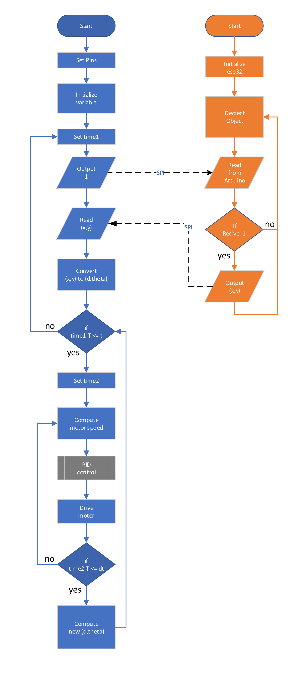

# README

## Hardwares
* Arduino uno
* Esp32-cam (with edge impulse)
* H-bridge motor driver (BTS7960)
* Photointerrupter (motor speed)
* Ultrasonic Sensor (distance)

## Software
* find the object coordinates
* loop for t secs
* update the trajectory every dt secs

